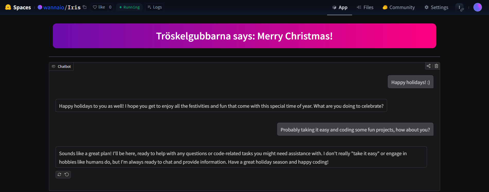

# Scalable Machine Learning Lab 2: LLM Fine-tuning and Deployment

This repository contains the implementation for Lab 2 of the Scalable Machine Learning course. The project is based on the Unsloth tutorial and is modified to include automatic checkpoint and bug fixes. The fine-tuned model was then deployed as an interactive chatbot on Hugging Face Spaces.

## :rocket: Deployment

The fine-tuned chatbot is deployed on Hugging Face Spaces and can be accessed here:
**[Iris Chatbot](https://huggingface.co/spaces/wannaio/Iris)**

## :hammer_and_wrench: Methodology

### Model and Dataset
Due to compute constraints, the **Llama 3.2 3B Instruct** model was selected as the base. Trying 1B seemed to perform much worse, so the 3B model was chosen.

For fine-tuning, the first 25,000 examples from the **[FineTome-100k](https://huggingface.co/datasets/mlabonne/FineTome-100k)** dataset were used. 

The training then took about an hour on Google Colab using an A100 GPU with batch size 50 and gradient accumulation steps 4.

## :package: Deployment Process

The deployment pipeline involved ensuring the model could run efficiently in a CPU-only environment on Hugging Face Spaces.

1.  **GGUF Conversion**: The fine-tuned model (merged adapters) was converted to the **GGUF** format using `llama.cpp`. The `q8_0` quantization method was selected since `q4_k_m` did not work in later steps.
2.  **Hugging Face Space**: A generic Space was set up using the `gradio` SDK.

### Challenges and Solutions
During deployment, the following issues were encountered and resolved:

-   **GGUF Saving**: Issues were encountered using Unsloth's built-in `model.save_pretrained_gguf` function. This was resolved by manually saving to GGUF format following the [Unsloth documentation](https://docs.unsloth.ai/basics/inference-and-deployment/saving-to-gguf#how-do-i-manually-save-to-gguf).
-   **HF Authentication**: The default configuration required authentication to access the model. This was resolved by removing the `hf_oauth: true` requirement from the Space's metadata to allow public access.
-   **Build Failures**: Issues were faced building `llama-cpp-python` in the Spaces environment (like mentioned [here](https://discuss.huggingface.co/t/latest-llama-cpp-wont-build-in-spaces/166357)). The issue stemmed from the fact that the latest version of `llama-cpp-python` was not compatible with the build environment. Therefore, an older version was used, and the version was pinned to `llama-cpp-python==0.3.3` in `requirements.txt`, ensuring compatibility with the build environment while maintaining support for the GGUF model version since older versions of `llama-cpp-python` do not work with Llama 3.2.

## :chart_with_upwards_trend: Task 2: Improving Pipeline Scalability and Model Performance

To further improve the model's performance and the pipeline's scalability, the following model-centric and data-centric approaches are proposed.

### (a) Model-Centric Approach

*   **Hyperparameter Tuning**: Systematically optimizing learning rate, scheduler type, and warmup steps, as well as experimenting with higher LoRA ranks (e.g., `r=32` or `64`) and targeting more modules.
*   **Advanced Fine-tuning**: Applying Direct Preference Optimization (DPO) or Reinforcement Learning from Human Feedback (RLHF) after initial SFT to improve alignment.
*   **Architecture Scaling**: We tried the 1B model which wasn't great, since we had some more resources we could use the 3B model. However scaling it further should also improve performance.

### (b) Data-Centric Approach

*   **Data Quality Filtering**: Implementing a pipeline to select high-quality examples based on complexity and diversity, and removing duplicates.
*   **Dataset Expansion**: Utilizing the full FineTome-100k dataset or incorporating task-specific datasets (e.g., GSM8K, HumanEval).
*   **Synthetic Data Generation**: Using larger models (e.g., GPT-5 API) to generate high-quality synthetic training data for knowledge distillation.
